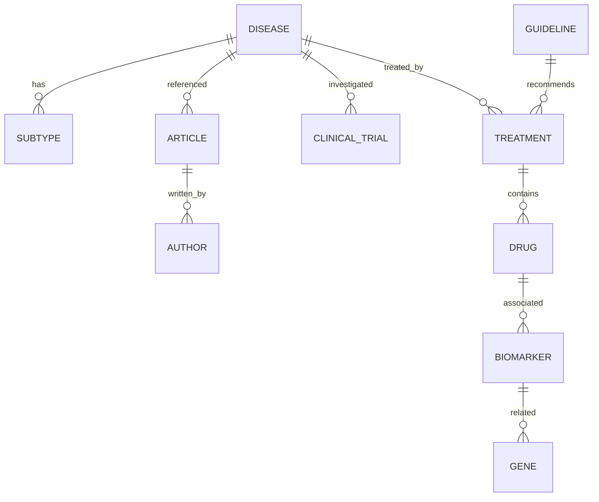

# Modelo de Domínio

## CholangioHub

---

# 1. Objetivo

Definir as principais entidades de negócio da plataforma e seus relacionamentos.

O modelo de domínio representa o conhecimento sobre colangiocarcinoma e será utilizado como referência para:

- Data Lake;
- Data Warehouse;
- APIs;
- Dashboard;
- Inteligência Artificial.

---

# 2. Conceito Principal

A entidade central da plataforma é:

Representando o colangiocarcinoma.

A partir dela conectam-se:

- diagnóstico;
- tratamentos;
- publicações;
- estudos;
- medicamentos;
- biomarcadores;
- diretrizes.

---

# 3. Modelo Conceitual

---

# 4. Princípios
Fonte como verdade

Toda informação deve manter referência original.

Histórico

Alterações precisam ser rastreáveis.

Flexibilidade

O modelo deve permitir novas descobertas científicas.

Interoperabilidade

Modelo preparado para integração futura com padrões médicos.