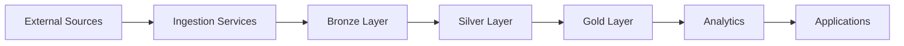

# Arquitetura de Dados

## CholangioHub

---

# 1. Objetivo

Definir como os dados serão coletados, armazenados, processados e disponibilizados pela plataforma.

---

# 2. Princípios

## Dados como ativo principal

A plataforma será construída orientada a dados.

---

## Rastreabilidade

Todo dado deverá possuir:

- origem;
- data de coleta;
- versão;
- transformação aplicada.

---

## Imutabilidade

Dados originais nunca serão sobrescritos.

---

## Reprocessamento

Todo pipeline deverá permitir execução histórica.

---

# 3. Arquitetura Geral

---

# 4. Tipos de dados
Documentos
artigos científicos;
PDFs;
guidelines;
relatórios.
Dados estruturados
estudos clínicos;
medicamentos;
genes;
biomarcadores.
Dados analíticos
indicadores;
métricas;
estatísticas.

# 5. Formatos

Dados brutos:

JSON
XML
HTML
PDF

Dados processados:

Parquet
Delta (futuro)

Dados analíticos:

SQL Tables